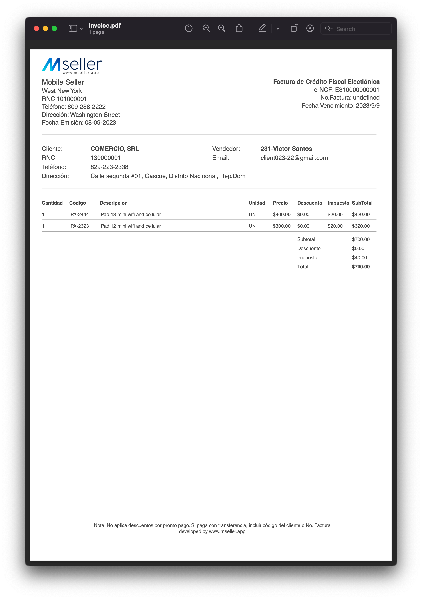

# PDFKit Invoices

<center>
  <a href="https://pspdfkit.com/web">
    
  </a>
</center>

## Prerequisites

- [Node.js](http://nodejs.org/) (with npm or Yarn)

## Getting Started

This repository is an example of how to make PDF invoices with PDFKit.

There are two important fields in this this repository:

- [`index.js`](index.js) is the main entry point. It defines the data structure used to create the invoices.
- [`createInvoice.js`](createInvoice.js) exports a function that can be used to create invoice PDFs.

To get started, use the following commands:

```bash
git clone git@github.com:victors1681/pdf-documents.git

npm install  # Install dependencies

npm start  # This will create an invoice.pdf file in the root of the project.
```

